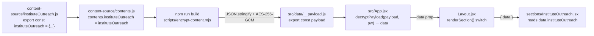
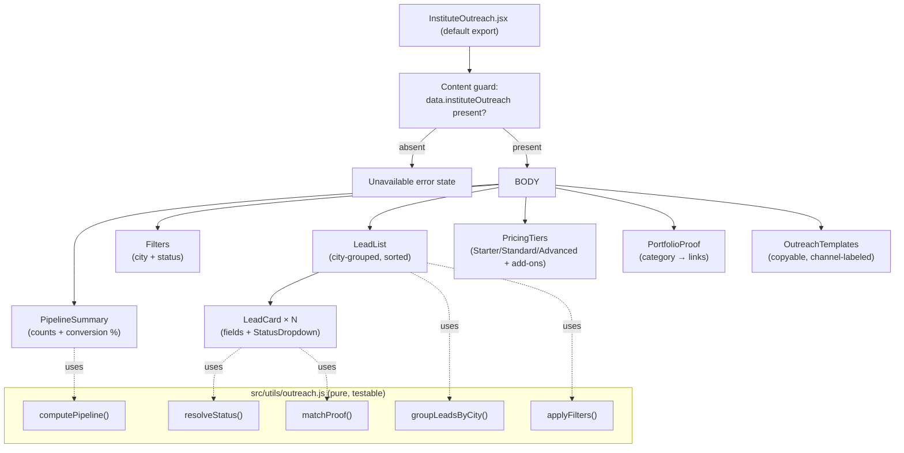

# Design Document: Institute Outreach

## Overview

The Institute Outreach feature adds a new dashboard section to the Ready2UP Private Growth Plan app. It is an outreach command center for winning website design/development work from small-to-mid colleges and schools, using the Navjeevan portfolio as credibility proof.

The section brings five capabilities into one place:

1. A **target-client lead list** grouped by city (Nashik → Pune → Mumbai → Other).
2. A **tiered pricing display** (Starter / Standard / Advanced) plus add-ons.
3. The **Navjeevan portfolio proof** matched by institute category.
4. **Copyable outreach templates** (email / WhatsApp) with placeholder tokens.
5. A reactive **pipeline status summary** with per-status counts and a closed-won conversion percentage.

Lead status edits persist locally through the existing `useLocalStorage` hook so tracking survives reloads, with no backend involved.

The feature is built entirely on existing app conventions:

- Content is authored in `content-source/instituteOutreach.js`, aggregated in `content-source/contents.js`, and encrypted into `src/data/__payload.js` by `scripts/encrypt-content.mjs`.
- The runtime decrypts the payload in `src/App.jsx` and passes the full `data` object to `Layout`, which renders the section and hands it the `data` prop.
- The UI reuses the shared primitives in `src/components/ui/Section.jsx` and the dark, glass, amber/rose, mobile-first theme.

### Design Goals

- **Zero pipeline deviation** — plug into the exact content → encrypt → decrypt → prop flow every other section uses.
- **Pure, testable core** — grouping, filtering, status resolution, and pipeline math are pure functions over data, isolated from React so they can be property-tested.
- **Graceful degradation** — missing content, empty leads, invalid persisted state, and clipboard failures all resolve to visible, non-crashing states.
- **Seed-agnostic schema** — the real Nashik/Pune/Mumbai lead list is researched and seeded during implementation; this design defines the schema that holds it, not the specific rows.

> **Note on lead data:** The concrete lead records (institute names, weaknesses, contact angles, contact fields) for Nashik, Pune, and Mumbai will be researched and populated into `content-source/instituteOutreach.js` during implementation. This design fixes the **Lead schema, category set, status set, and city ordering** that those records must conform to. It does not enumerate the rows themselves.

## Architecture

### Content-to-Runtime Pipeline

The feature reuses the app's existing static-content encryption pipeline without modification. The only additions are one new content module and one new key in the aggregator.



Key facts this relies on (verified against the codebase):

- `contents.js` imports each module and spreads named consts into a single `contents` object with `builtAt`/`version` fields. Adding `instituteOutreach` follows the same one-line-import + one-key pattern used by `channels`, `pricing`, etc.
- `encrypt-content.mjs` dynamically imports `contents.js`, `JSON.stringify`s the whole `contents` object, AES-256-GCM encrypts it (PBKDF2-SHA256, 600k iters), and writes `src/data/__payload.js`. Because it serializes the entire object, **any record in the new module is preserved verbatim** in the payload (Req 2.3).
- `App.jsx` calls `decryptPayload(payload, password)` and passes the result as `data` to `Layout`. `Layout.renderSection()` builds `props = { data }` and returns `<Section {...props} />`. The new section reads `data.instituteOutreach` and destructures it (Req 2.5).

### Build Guard for Missing Content (Req 2.4)

`encrypt-content.mjs` currently validates only that `contents` exists. To satisfy Req 2.4 (build must fail and produce no payload if the outreach content is missing), the encrypt script gains a small pre-encryption assertion:

```js
// after loadContents()
if (!contents.instituteOutreach) {
  console.error('\n❌ Missing `instituteOutreach` in aggregated content. ' +
    'Add it to content-source/contents.js before building.\n');
  process.exit(1); // exits BEFORE writeFileSync — no payload produced
}
```

The guard runs before `encrypt()` and `writeFileSync`, so a missing key aborts with a clear message and leaves the previous payload untouched.

### Section Registration (Req 1)

`Layout.jsx` changes are additive and mirror existing execution-group entries:

1. Import the icon (e.g. `GraduationCap`) from `lucide-react` in the top import block.
2. Import the section: `import InstituteOutreach from './sections/InstituteOutreach.jsx';`.
3. Add exactly one `NAV` entry in the `execution` group:
   `{ id: 'institute-outreach', label: 'Institute Outreach', icon: GraduationCap, group: 'execution' }`.
4. Add one `renderSection()` case: `case 'institute-outreach': return <InstituteOutreach {...props} />;`.

No route, meta tag, or markup is added, so the app's existing noindex config and password gate are inherited unchanged (Req 10.2, 10.6). The section only mounts after `PasswordGate` unlocks and `Layout` renders (Req 10.1).

### Component Architecture



The **pure logic layer** (`src/utils/outreach.js`) contains all decision logic and holds no React state. The React components are thin: they call these functions, memoize results, and render. This separation is what makes the correctness properties directly testable.

## Components and Interfaces

### `src/components/sections/InstituteOutreach.jsx` (default export)

Top-level orchestrator. Responsibilities:

- Read `const io = data?.instituteOutreach;`. If falsy → render the unavailable error state and return (Req 1.6, 2.6).
- Own the two filter states: `cityFilter` (`'all' | 'Nashik' | 'Pune' | 'Mumbai' | 'Other'`) and `statusFilter` (`'all' | <one of 7 statuses>`), via `useState`.
- Own the persisted status overrides via `useLocalStorage('io_lead_status', {})` → an object map `{ [leadId]: status }`.
- Compute derived data with `useMemo`:
  - `resolvedLeads` = each seed lead merged with its resolved status (override → seed → default), via `resolveStatus`.
  - `pipeline` = `computePipeline(resolvedLeads, cityFilter)`.
  - `visibleGroups` = `groupLeadsByCity(applyFilters(resolvedLeads, cityFilter, statusFilter))`.
- Render sub-components, passing data + callbacks.

Interface (props): `{ data }` — consistent with all other sections.

### `PipelineSummary`

Props: `{ pipeline }` where `pipeline = { counts: Record<Status, number>, total: number, conversionPct: number }`.

- Renders one `StatCard`/pill per status showing its count, including 0 for statuses with no leads (Req 9.1).
- Renders `StatCard` for total leads and for closed-won conversion `${conversionPct}%` (Req 9.6).
- Recomputes reactively because `pipeline` is a memoized value derived from `resolvedLeads` + `cityFilter` (Req 9.2, 9.4, 9.5). No manual refresh.

### `Filters`

Props: `{ cityFilter, statusFilter, onCityChange, onStatusChange, onClear }`.

- City selector: `all` + the four city buckets (uses `<select>` or pill row like `Scripts.jsx`).
- Status selector: `all` + the seven statuses.
- Filter controls always remain mounted, including when zero leads match, so the user can change/clear the selection (Req 4.9).

### `LeadList`

Props: `{ groups }` where `groups` is an **ordered** array `[{ city, leads }]` already sorted Nashik → Pune → Mumbai → Other, each `leads` sorted alphabetically case-insensitive by name.

- Renders one group block per non-empty group with the city name and lead count (Req 4.1, 4.2, 4.3).
- If `groups` is empty (no leads match filters) → renders the "no leads match" empty state while `Filters` stays mounted (Req 4.9).
- If the seed `leads` array is entirely empty → renders an empty-state message (Req 1.6).

### `LeadCard`

Props: `{ lead, resolvedStatus, suggestedProof, onStatusChange, persistError }`.

Renders institute name, category, city, weakness, contact angle, suggested portfolio proof link, and the current status (Req 4.4). Any missing weakness / contact angle / proof renders a visible placeholder (e.g. "— not available") rather than being omitted (Req 4.5). Optional contact fields (phone/email/website) render only when present; absent ones are simply not shown and never treated as errors (Req 3.7).

Contains the `StatusDropdown`.

### `StatusDropdown`

Props: `{ value, onChange, error }`.

- `<select>` restricted to exactly the seven statuses (Req 5.4).
- On change → calls `onChange(leadId, newStatus)`; the parent updates state + persists.
- If `error` is set (persist verification failed) → shows a small "not saved" indicator next to the control (Req 5.6).

### `PricingTiers`

Props: `{ pricingTiers, addOns }`.

- If `pricingTiers` is missing/empty → render "pricing unavailable" and no partial tier prices (Req 6.8).
- Renders exactly three tiers in order Starter → Standard → Advanced (Req 6.1) with name, price range, scope text.
- Standard tier is visually marked as the recommended offer (reusing the `featured` card treatment from `Pricing.jsx`) (Req 6.5).
- Renders add-ons (yearly maintenance, SEO, admission-season landing pages) with a "quoted separately" label (Req 6.6, 6.7).

### `PortfolioProof`

Props: `{ portfolioProof }`.

- Renders exactly one labeled group per institute category, each showing the category name and its link(s) (Req 7.1, 7.2).
- All links open in a new tab with `target="_blank" rel="noopener noreferrer"` so the new tab gets no programmatic access to the opener (Req 7.3).

### `OutreachTemplates`

Props: `{ outreachTemplates }`.

- Renders each template with a channel label ("email" or "WhatsApp") and its body with placeholder tokens shown verbatim in a `<pre>` block (Req 8.1, 8.2), mirroring `Scripts.jsx`.
- Copy button uses `navigator.clipboard.writeText(body)`; on success shows a confirmation for ~2s then removes it; on failure shows an error indication and leaves the displayed text unchanged (Req 8.3, 8.4, 8.5).

## Data Models

### The `instituteOutreach` content object

Exported from `content-source/instituteOutreach.js` and aggregated under `contents.instituteOutreach`.

```js
export const instituteOutreach = {
  offer: {
    headline: string,          // short offer statement
    description: string,       // 1–3 sentence pitch
  },

  leads: Lead[],               // seed lead records (see Lead)

  pricingTiers: PricingTier[], // exactly 3, ordered Starter, Standard, Advanced
  addOns: AddOn[],             // yearly maintenance, SEO, admission-season landing pages

  portfolioProof: PortfolioProofGroup[], // one per institute category

  outreachTemplates: OutreachTemplate[], // ≥ 1, email/WhatsApp
};
```

### `Lead`

```js
{
  id: string,                 // unique across all leads
  name: string,               // institute name, 1–200 chars
  category: InstituteCategory,// one of the ordered category list
  city: City,                 // 'Nashik' | 'Pune' | 'Mumbai' | 'Other'
  weakness: string,           // current website weakness
  suggestedProof: string,     // category key OR a resolved proof label
  proofUrl?: string,          // convenience: matched Navjeevan URL (derivable from category)
  contactAngle: string,       // the outreach hook for this institute
  status?: OutreachStatus,    // optional; absent → 'Not contacted' (Req 3.2)

  // optional contact fields — any/all may be absent (Req 3.7)
  phone?: string,
  email?: string,
  website?: string,
}
```

Constraints enforced by the seed data and validated in tests:

- `id` unique (Req 3.5).
- `name` length 1–200 (Req 3.1).
- `city` ∈ closed City set (Req 3.3).
- `category` ∈ closed InstituteCategory set (Req 3.1, 3.4).
- `status`, if present, ∈ the seven `OutreachStatus` values, which includes `'Not contacted'` (Req 3.6).
- `category` has a matching `PortfolioProofGroup` (Req 3.4, 7.4).

### `OutreachStatus` (closed set of 7)

Ordered for pipeline display:

```js
export const OUTREACH_STATUSES = [
  'Not contacted',
  'Contacted',
  'Replied',
  'Meeting',
  'Proposal sent',
  'Closed won',
  'Closed lost',
];
export const CLOSED_WON = 'Closed won';
```

These seven values are the only selectable statuses (Req 5.4) and the only valid persisted values (Req 5.7).

### `City` (ordered)

```js
export const CITY_ORDER = ['Nashik', 'Pune', 'Mumbai', 'Other'];
```

`groupLeadsByCity` always emits groups in this order; any lead whose city is not one of the first three is placed in `'Other'` (Req 4.2).

### `InstituteCategory` (ordered, closed)

```js
export const INSTITUTE_CATEGORIES = [
  'MBA',
  'Trust/Foundation',
  'Pharmacy college',
  'Day school',
  'Science college',
  'School',
  'Law college',
];
```

### `PricingTier`

```js
{
  id: 'starter' | 'standard' | 'advanced',
  name: 'Starter' | 'Standard' | 'Advanced',
  priceRange: string,      // e.g. '₹20,000 – ₹35,000'
  scope: string,           // scope description
  recommended?: boolean,   // true only for Standard (Req 6.5)
}
```

Seed values (Req 6.2–6.4):

| Tier | Price range | Scope |
|------|-------------|-------|
| Starter | ₹20,000 – ₹35,000 | 4 to 6 page small site |
| Standard (recommended) | ₹40,000 – ₹75,000 | 8 to 12 page admissions-focused site |
| Advanced | ₹90,000 – ₹1,50,000 | near-Navjeevan custom build |

### `AddOn`

```js
{
  id: string,
  name: string,        // 'Yearly maintenance' | 'SEO' | 'Admission-season landing pages'
  priceRange?: string, // e.g. '₹8,000 – ₹15,000 / year' for maintenance (Req 6.6)
}
```

All add-ons are displayed under a "quoted separately" label (Req 6.7).

### `PortfolioProofGroup`

```js
{
  category: InstituteCategory, // exactly one group per category (Req 7.1)
  urls: string[],              // one or more Navjeevan URLs
}
```

Seed values (Req 7.2):

| Category | URL(s) |
|----------|--------|
| MBA | https://navjeevanmba.com/ |
| Trust/Foundation | https://navjeevannashik.org/ , https://navjeevanfoundationnashik.org/ |
| Pharmacy college | https://navjeevanpharmacycollege.com/ |
| Day school | https://navjeevandayschoolsinnar.com/ |
| Science college | https://navjeevandayschoolsinnar.com/navjeevan-college-of-science/ |
| School | https://navjeevanschoolnashik.com/ |
| Law college | https://www.navjeevanlawcollege.com/ |

### `OutreachTemplate`

```js
{
  id: string,
  channel: 'email' | 'WhatsApp',  // drives the channel label (Req 8.1)
  label: string,                  // human-readable title
  body: string,                   // may contain placeholder tokens like [Institute Name] (Req 8.2)
}
```

### Persisted state (`Lead_Store`)

Stored via `useLocalStorage('io_lead_status', {})`, namespaced by the hook to `r2up_v1::io_lead_status`. Shape:

```js
{ [leadId: string]: OutreachStatus }
```

Only leads whose status the user changed appear here. All others fall back to seed/default. This keeps the store small and makes seed changes non-destructive.

### Status resolution precedence (`resolveStatus`)

For a given lead, the effective status is resolved in this order (Req 5.5, 5.7, 3.2):

1. If `store[lead.id]` exists **and** is one of the seven valid statuses → use it.
2. Else if `store[lead.id]` exists but is **invalid** → ignore it, fall through.
3. Else if `lead.status` is present → use `lead.status`.
4. Else → `'Not contacted'`.

```js
function resolveStatus(lead, store) {
  const persisted = store[lead.id];
  if (persisted && OUTREACH_STATUSES.includes(persisted)) return persisted;
  if (lead.status && OUTREACH_STATUSES.includes(lead.status)) return lead.status;
  return 'Not contacted';
}
```

### Persistence with verified read-back (Req 5.6)

`useLocalStorage` swallows write errors silently (verified: its `useEffect` wraps `setItem` in `try/catch` with an empty catch). To satisfy Req 5.6 ("if persisting fails, retain last successfully persisted value and indicate not saved"), the section wraps status changes in a verification step rather than relying on the hook alone:

```js
function commitStatus(leadId, newStatus) {
  const prevStore = statusStore;
  const nextStore = { ...prevStore, [leadId]: newStatus };
  setStatusStore(nextStore);                       // optimistic UI + hook persist
  // Verify the write actually landed by reading it straight back.
  try {
    const raw = localStorage.getItem('r2up_v1::io_lead_status');
    const roundTripped = raw ? JSON.parse(raw) : {};
    if (roundTripped[leadId] !== newStatus) throw new Error('verify failed');
    clearPersistError(leadId);
  } catch {
    setStatusStore(prevStore);                     // roll back to last good value
    setPersistError(leadId);                        // drive the "not saved" indicator
  }
}
```

The read-back runs after React flushes the hook's effect. In practice the write and effect are synchronous for `localStorage`; the verification is performed by re-reading the namespaced key on the next tick (via `queueMicrotask`/`useEffect` keyed on the pending change) so the roll-back and indicator are accurate. The displayed value always equals the last successfully persisted value.

## Correctness Properties

*A property is a characteristic or behavior that should hold true across all valid executions of a system — essentially, a formal statement about what the system should do. Properties serve as the bridge between human-readable specifications and machine-verifiable correctness guarantees.*

The following properties target the pure logic layer in `src/utils/outreach.js`, which is the part of this feature with meaningful input-dependent behavior. They will be validated with a property-based testing library (fast-check) at minimum 100 iterations each.


### Property 1: Content serialization round-trip

*For any* valid `instituteOutreach` content object, serializing it (as the build step does via `JSON.stringify`) and then deserializing it produces a deeply-equal object, preserving every lead, tier, add-on, proof group, and template without omission or alteration.

**Validates: Requirements 2.3**

### Property 2: Lead validator accepts well-formed leads and rejects malformed ones

*For any* generated lead, the lead validator accepts it if and only if it has all required fields (id, name, category, city, weakness, suggestedProof, contactAngle), its name length is between 1 and 200 characters inclusive, its city is one of the four City values, and its category is one of the closed InstituteCategory set — regardless of which optional contact fields (phone, email, website) are present or absent.

**Validates: Requirements 3.1, 3.3, 3.7**

### Property 3: Lead identifiers are unique

*For any* collection of leads, the uniqueness validator reports a violation if and only if two or more leads share the same `id` value.

**Validates: Requirements 3.5**

### Property 4: Status resolution precedence

*For any* lead and any status store, `resolveStatus` returns the valid persisted override if one exists; otherwise the lead's seed status if present; otherwise `'Not contacted'`.

**Validates: Requirements 3.2, 5.5**

### Property 5: Status resolution closure and invalid-value fallback

*For any* lead and any status store (including stores containing arbitrary/garbage values), the output of `resolveStatus` is always one of the seven defined `OutreachStatus` values, and any persisted value that is not one of the seven is ignored in favor of the lead's seed status or the default.

**Validates: Requirements 3.6, 5.7**

### Property 6: Persistence round-trip

*For any* lead and any valid status assigned to it, writing that status to the store and reading it back through the resolution path returns the same status, so a reload displays the previously persisted value.

**Validates: Requirements 5.3**

### Property 7: City grouping invariants

*For any* collection of leads, `groupLeadsByCity` produces groups whose order is a subsequence of `[Nashik, Pune, Mumbai, Other]`; every lead whose city is not Nashik, Pune, or Mumbai appears in the `Other` group; each group's reported count equals the number of input leads in that group; every input lead appears in exactly one group; and within each group the leads are ordered non-decreasing by institute name under case-insensitive comparison.

**Validates: Requirements 4.1, 4.2, 4.3**

### Property 8: Filter conjunction subset

*For any* collection of leads, any city filter selection, and any status filter selection, the filtered result contains exactly those leads whose city matches the city filter (or the filter is "all") and whose resolved status matches the status filter (or the filter is "all"); the result is always a subset of the input, and no lead satisfying both active predicates is dropped.

**Validates: Requirements 4.6, 4.7, 4.8**

### Property 9: Status-change isolation

*For any* collection of leads and any single status change applied to one lead, after the change that lead resolves to the new status and every other lead's resolved status is unchanged.

**Validates: Requirements 5.1**

### Property 10: Pipeline counts partition the scoped leads

*For any* collection of leads, any status store, and any city scope (a specific city or none), `computePipeline` returns a `counts` map containing an entry for every one of the seven statuses (defaulting to 0), where each count equals the number of scoped leads whose resolved status is that status, and the sum of all counts equals the total number of scoped leads.

**Validates: Requirements 9.1, 9.3, 9.4, 9.5**

### Property 11: Conversion percentage bounds

*For any* collection of leads, the closed-won conversion figure returned by `computePipeline` is an integer between 0 and 100 inclusive, equals the closed-won lead count divided by the total lead count times 100 rounded to the nearest whole percent, and equals 0 when the total lead count is 0.

**Validates: Requirements 9.6**

### Property 12: Proof match determinism

*For any* lead whose category has a matching `PortfolioProofGroup`, `matchProof` deterministically returns that group, whose category equals the lead's category.

**Validates: Requirements 3.4, 7.4**

### Property 13: Proof fallback for unmatched categories

*For any* lead whose category has no matching `PortfolioProofGroup`, `matchProof` returns all available proof groups flagged as a fallback (indicating no category-specific proof is available).

**Validates: Requirements 7.5**

### Property 14: Template copy fidelity

*For any* outreach template, the string handed to the clipboard equals the template body exactly, including any placeholder tokens verbatim, with no substitution or transformation.

**Validates: Requirements 8.2, 8.3**

## Error Handling

| Scenario | Handling | Requirement |
|----------|----------|-------------|
| `data.instituteOutreach` absent/undefined | Section renders an "outreach content unavailable" message; no partial content rendered | 1.6, 2.6 |
| `leads` array empty | Lead list renders an empty-state message; pipeline shows all-zero counts and 0% conversion | 1.6, 9.6 |
| Build run with `contents.instituteOutreach` missing | `encrypt-content.mjs` guard logs an error and `process.exit(1)` before writing the payload; no payload produced | 2.4 |
| Filters match zero leads | Empty-state message shown; filter controls remain mounted and interactive | 4.9 |
| Lead field (weakness / angle / proof) empty | Visible placeholder ("— not available") rendered in place of the field | 4.5 |
| Persisted status value invalid (not one of 7) | `resolveStatus` ignores it and falls back to seed/default; output always valid | 5.7 |
| `localStorage` write fails / verification mismatch | Roll back to last successfully persisted value; show "not saved" indicator on that lead | 5.6 |
| Pricing data missing/empty | "Pricing unavailable" message; no partial or placeholder tier prices | 6.8 |
| Lead category has no matching proof | Show all proof groups as fallback with a visible "no category-specific proof" indication | 7.5 |
| `navigator.clipboard.writeText` rejects | Show copy-failed error indication; displayed template text left unchanged | 8.5 |

All content reads use optional chaining and defaulting (`data?.instituteOutreach ?? null`, `io.leads ?? []`, etc.) so no missing field throws.

## Testing Strategy

### Dual approach

- **Property-based tests** validate the universal properties above against the pure logic layer (`src/utils/outreach.js`). These carry the bulk of correctness coverage across the large input space of lead collections, stores, and filters.
- **Unit / example tests** cover specific literal seed values, rendering completeness, wiring, and error-handling scenarios that are not input-varying.

### Property-based testing

- **Library:** [fast-check](https://github.com/dubzzz/fast-check) with the existing test runner (Vitest, per the Vite toolchain). Do not hand-roll generators or a PBT engine.
- **Iterations:** minimum 100 runs per property (`fc.assert(fc.property(...), { numRuns: 100 })`).
- **Tagging:** each property test is tagged with a comment in the format
  `// Feature: institute-outreach, Property {number}: {property text}`.
- **Generators:** custom arbitraries for `Lead` (drawing category from `INSTITUTE_CATEGORIES`, city from a set that includes off-list values to exercise the `Other` bucket, name from strings including mixed case and empty, optional contact fields randomly present/absent), for status stores (including invalid/garbage values to exercise Property 5), and for the full `instituteOutreach` object (Property 1).
- Each of the 14 properties maps to exactly one property-based test.

### Example / unit tests

- Nav registration: exactly one `execution`-group entry with id `institute-outreach` (Req 1.1, 1.2, 1.4, 5.4 option set, 10.3, 10.6 structural checks).
- Content shape: `contents.instituteOutreach` exists and exposes leads/offer/pricingTiers/addOns/portfolioProof/outreachTemplates (Req 2.1, 2.2).
- Build guard: guard function errors and does not write when the key is missing (Req 2.4).
- Pricing literals: three tiers with exact ranges/scopes, Standard recommended, add-on ranges and "quoted separately" label (Req 6.1–6.7).
- Proof literals: category→URL mapping matches spec; anchors use `target="_blank" rel="noopener noreferrer"` (Req 7.2, 7.3).
- Rendering completeness: a rendered lead shows all required fields; empty fields show placeholders (Req 4.4, 4.5).
- Templates: ≥1 template, channel labels present, tokens shown verbatim (Req 8.1, 8.2).
- Clipboard behavior with fake timers: confirmation appears then clears within 5s (Req 8.4); rejection shows error and leaves text unchanged (Req 8.5).
- Persistence failure: mocked `localStorage`/verification mismatch triggers roll-back and "not saved" indicator (Req 5.6); successful change writes the namespaced key (Req 5.2).
- Reactivity: changing a status updates pipeline counts without reload (Req 9.2).
- Empty/error states: missing content, empty leads, zero-match filters, missing pricing (Req 1.6, 2.6, 4.9, 6.8).

### Responsive / privacy checks

- Single-column at ≤767px and multi-column at ≥768px verified via Tailwind breakpoint classes and a visual check (Req 10.4, 10.5).
- Password-gate inheritance verified by asserting the section only mounts under an unlocked `Layout` and is absent from locked markup (Req 10.1, 10.2). No new route or meta tag is introduced, preserving noindex (Req 10.6).
