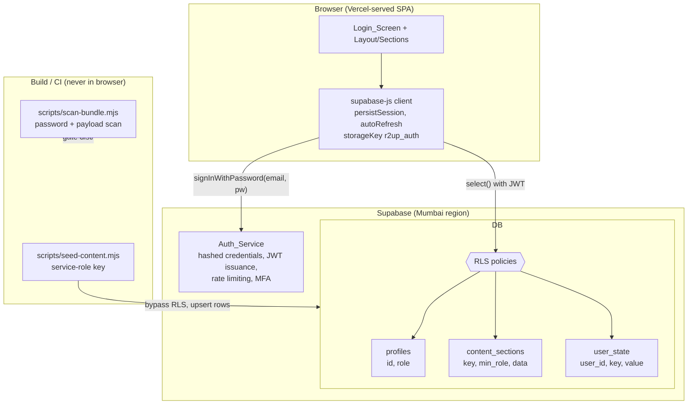
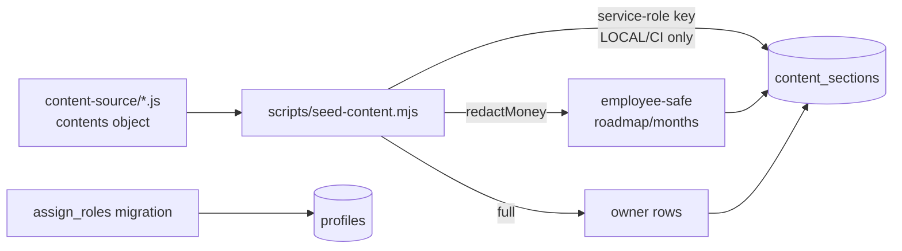

# Design Document

## Overview

This design re-architects the Ready2UP Growth Plan dashboard from **client-side tiered
encryption** (the `team-dashboard-access` spec) to **true server-side authentication and
authorization** built on the project's existing Supabase (Postgres + Auth) and Vercel stack.

Today the dashboard is a React + Vite + Tailwind + Recharts SPA. All plan content ships
(encrypted) inside the JavaScript bundle, and a role's password decrypts only that role's tier
in the browser (`src/access/*`, `src/data/__payload.js`, `scripts/encrypt-content.mjs`). That
guarantees *visibility* but not *security*: every byte of content physically reaches every
browser, and anyone holding a tier password can extract that tier.

The new model makes **Supabase Postgres the source of truth** for plan content and enforces
authorization with **Row-Level Security (RLS)** keyed to the authenticated user's role. The
browser only ever receives the rows the authenticated role is permitted to read. Content a
role may not see is *never transmitted* to that browser — verifiable in the network inspector.
Authentication uses **Supabase Auth with a password-only login**: the user types only a
password; the account email comes from a non-secret `VITE_` env var; Supabase validates the
password server-side against the hashed credential. No password ever enters the bundle or any
env var.

### Key design decisions

| # | Decision | Rationale |
|---|----------|-----------|
| 1 | **Reuse the existing Supabase client** (`src/lib/supabase.js`) with its `persistSession` / `autoRefreshToken` / `storageKey: 'r2up_auth'` config. | Session persistence (Req 9) and auto-refresh are already configured; no new client needed. |
| 2 | **Role stored in a `profiles` table** (`profiles.role`), read by RLS via a `SECURITY DEFINER` helper `public.current_role()`. | A table row is trivially seedable for the two existing users, inspectable, and changeable without re-issuing tokens. Avoids the operational complexity of custom-access-token auth hooks. Extensible to N employee accounts (Req 16). |
| 3 | **One `content_sections` table**: `key text`, `min_role text`, `data jsonb`. Each section is a row tagged with the minimum role allowed to read it. | Makes RLS a single, simple `SELECT` policy. The browser reconstructs the `{ key: data }` object the existing section components already consume. |
| 4 | **Money redaction via pre-computed redacted variants (two rows)**, not a per-request RPC. Employee-safe `roadmap`/`months` rows (money stripped, `min_role='employee'`) coexist with full owner rows (`min_role='owner'`). | Money that is never stored in a row an employee can select can never be transmitted (Req 7). Redaction is a single deterministic pure function run once at seed time — easy to property-test. No per-request server compute, no `SECURITY DEFINER` surface to get wrong. |
| 5 | **Retire the client-side encryption path**: delete `src/data/__payload.js`, `src/access/resolveRole.js`, `src/crypto/*`, and the `encrypt-content.mjs` build step. Keep `visibility.js`'s section→nav knowledge as UI config only (no security role). | Req 15 requires the encrypted payload to be gone from the bundle; the post-build scan enforces it. |
| 6 | **Keep the existing `user_state` cloud-sync table** for trackers, but add RLS so only the row owner (and only the owner *role*) can read/write. | Preserves the working tracker sync (Req 14) while closing the gap that RLS was never enforced. |

### Scope boundary: what is verified where

RLS enforcement is a **database** guarantee. Unit / property tests in the JS project verify the
*pure logic* (redaction completeness, row→object reconstruction, login resolution order, nav
derivation). The RLS policies themselves (employee cannot read owner rows, unauthenticated
denied) are verified with **integration tests against a real Supabase instance** (local
`supabase start` or a dedicated test project) — this is called out explicitly in the Testing
Strategy because it cannot be meaningfully faked with mocks.

---

## Architecture

### System context



### Authentication + content-fetch flow

```mermaid
sequenceDiagram
    participant U as User
    participant App as Dashboard_App
    participant SB as supabase-js
    participant Auth as Auth_Service
    participant DB as Postgres (RLS)

    Note over App: On load — session restore (Req 9.2)
    App->>SB: auth.getSession()
    alt valid persisted session
        SB-->>App: session {user, role via profile}
        App->>DB: getProfileRole(user.id)
        App->>DB: select * from content_sections
        DB-->>App: only rows allowed for role
        App->>App: rows -> { key: data } ; render Layout
    else no / expired session
        SB-->>App: null
        App->>U: show Login_Screen
    end

    Note over U,Auth: Password-only login (Req 1)
    U->>App: submit password P
    App->>App: validate non-empty, len<=72 (Req 1.3, 1.8)
    loop emails in fixed order [OWNER_EMAIL, EMPLOYEE_EMAIL]
        App->>SB: signInWithPassword({email_i, P}) [10s timeout]
        SB->>Auth: verify server-side
        alt success
            Auth-->>App: session (stop loop, Req 1.6)
        else invalid / rate-limited / timeout
            Auth-->>App: error -> try next / surface error
        end
    end
    App->>DB: getProfileRole(user.id)  (Req 3.3)
    App->>DB: select content_sections   (Req 4.2, 5)
    DB-->>App: role-appropriate rows only
    App->>App: reconstruct data object, render
```

### Layering

- **Transport / auth layer** — `supabase-js`. Owns sessions, tokens, refresh, storage. Unchanged
  config, extended usage (login + role fetch).
- **Authorization layer** — Postgres RLS policies + `profiles`. The *only* place access is
  decided. The browser cannot influence it beyond presenting its JWT.
- **Data-access layer (new)** — `src/lib/content.js`: `signInResolvingRole(password)`,
  `fetchContent(session)`, `getRole(userId)`, `rowsToContentObject(rows)`. Pure-ish wrappers
  around Supabase calls, with the reconstruction logic as a pure function.
- **Presentation layer** — existing `Layout.jsx` + `sections/*`, fed the reconstructed
  `{ key: data }` object exactly as today. Nav filtering becomes a function of *which rows
  arrived*, not of a client tier table.

---

## Components and Interfaces

### New / changed modules

#### `src/lib/supabase.js` (minor change)
Unchanged client config. Add exported constants for the two account emails:

```js
export const OWNER_EMAIL    = import.meta.env.VITE_SUPABASE_LOGIN_EMAIL || '';
export const EMPLOYEE_EMAIL = import.meta.env.VITE_SUPABASE_EMPLOYEE_EMAIL || '';
// Fixed evaluation order for password-only login (Req 1.6).
export const LOGIN_EMAILS = [OWNER_EMAIL, EMPLOYEE_EMAIL].filter(Boolean);
```

#### `src/lib/auth.js` (new) — password-only login resolution

```js
// Resolve exactly one session/role from a typed password by trying each
// predefined email in a FIXED order, stopping on first success (Req 1.6).
//
// Returns one of:
//   { ok: true,  role, session }
//   { ok: false, code: 'empty'      }   // Req 1.8 / 2.2  (no network call made)
//   { ok: false, code: 'invalid'    }   // Req 1.9 / 2.1  (no email matched)
//   { ok: false, code: 'ratelimited'}   // Req 2.6 / 13.3
//   { ok: false, code: 'timeout'    }   // Req 1.10 / 2.7 (>10s or unreachable)
export async function signInResolvingRole(password, deps = defaults) { ... }
```

Behaviour contract:
- **Empty / whitespace-only** password → return `{code:'empty'}` **without** any network call
  (Req 1.8, 2.2). Note: the client does **not** trim the password before sending; the
  emptiness check is "is the raw string zero-length or only whitespace" purely to decide
  whether to skip the call. The value actually sent to Supabase is the raw, untrimmed string
  (Req 1.7).
- Length guard: reject before sending if `password.length > 72` is not required by Supabase, but
  Req 1.3 constrains the *submitted* password to ≤72 chars; the UI enforces `maxLength=72`.
- For each email in `LOGIN_EMAILS` (fixed order), call `signInWithPassword({email, password})`
  wrapped in a **10-second timeout** (`Promise.race`). On the **first** success, resolve the
  role from the profile and **return immediately without trying later emails** (Req 1.6).
- Distinguish error kinds from the Supabase error: `status === 429` or a rate-limit message →
  `ratelimited`; timeout/network → `timeout`; otherwise, after all emails fail with
  invalid-credential errors → `invalid`.
- On success, **sign out any partial session** is unnecessary because exactly one call
  succeeds; but if an earlier email unexpectedly created a session it is overwritten by the
  successful one. Because only one password is tried per email and Supabase validates
  server-side, at most one email matches.

**Why trying-each-email is safe (design note for Req 1, 11):** The account emails are *not*
secrets — they are identifiers already known and inlined as public env vars. The password is
validated **server-side** by Supabase against a salted hash; the browser never sees any stored
credential and no password is embedded anywhere. Trying the owner email then the employee email
with the same typed password is equivalent to two normal login attempts; it leaks nothing a
normal login wouldn't, and the server's own rate limiting (Req 13) still applies per account.
The password is never logged, never persisted (only Supabase's token pair is), and never placed
in an env var.

#### `src/lib/content.js` (new) — role + content data access

```js
// Read the caller's role from their profile row (Req 3.3, 3.4).
// Returns 'owner' | 'employee' | null (null => treated as least-privileged/denied).
export async function getRole(userId) { ... }

// Fetch all content rows the caller's JWT is permitted to read (Req 4.2, 5).
// RLS does the filtering; the client sends a plain select.
export async function fetchContent() {
  const { data, error } = await supabase
    .from('content_sections')
    .select('key, data');           // min_role never leaves the DB
  ...
}

// PURE: reconstruct the { key: data } object the existing sections expect
// from the returned rows. Later rows do NOT override earlier ones for the
// same key (the DB only ever returns ONE row per key per role, but this keeps
// the function total and deterministic).
export function rowsToContentObject(rows) {
  const out = {};
  for (const r of rows ?? []) {
    if (r && typeof r.key === 'string' && !(r.key in out)) out[r.key] = r.data;
  }
  return out;
}

// PURE: which nav ids are shown = nav entries whose backing content keys are
// all present in the fetched object (derives visibility from DATA, not a tier
// table). Reuses NAV_CONTENT mapping (moved to a UI-config module).
export function navIdsFromContent(contentObj) { ... }
```

#### `src/App.jsx` (rewritten auth flow)
Replaces the client-side `unlock(password, payload)` path with:
1. On mount: `supabase.auth.getSession()` + `onAuthStateChange` (already present) — on a valid
   session, fetch role + content and render without the login screen (Req 9.2).
2. `handleLogin(password)` → `signInResolvingRole(password)` → on `ok`, fetch content, build
   `data` object, set `role`, render `Layout`. On failure, map `code` to the correct
   `PasswordGate` message and clear the input on `invalid` (Req 1.9, 2.x).
3. `logout()` → `supabase.auth.signOut()`; on error, the local session is still cleared and the
   login screen shown (Req 10.4). Uses the existing `setAuthState(null)` to stop tracker sync.
4. Remove `REMEMBERED_PW_KEY` and all remembered-password storage — sessions are Supabase's job
   now, and Req 9.6 forbids persisting the password. This *also* removes the current design's
   device-stored plaintext password.

#### `src/components/PasswordGate.jsx` (minor change)
Add `maxLength={72}` (Req 1.3) and render new error codes: `empty`, `invalid`, `ratelimited`,
`timeout`, `unavailable`. No email field is ever shown (Req 1.1). It already exposes a single
password input.

#### `src/components/Layout.jsx` (small change)
- Nav filtering switches from `permittedNavIds(role)` (client tier table) to
  `navIdsFromContent(data)` — a nav entry shows only when its backing content actually arrived.
  This makes the UI a pure reflection of server authorization (Req 5.3, 6.3, 8.2).
- The "Building to ₹5CR" badge and `WelcomeIntro` overlay render only when `role === 'owner'`
  (Req 6.4, 8.5) — already keyed on role, retained.
- `dailyRoutine` (personal daily routine) is simply absent from the employee's `rhythm` data
  (see Data Models); the `Rhythm` section renders weekly+monthly only when daily is missing
  (Req 6.2).

#### `src/lib/cloudSync.js` (no code change; relies on new RLS)
Keeps working unchanged. Correctness now depends on RLS on `user_state` (see Data Models).

### Retired modules (Req 15)
- `src/data/__payload.js` — deleted; no encrypted payload in the bundle.
- `src/access/resolveRole.js`, `src/crypto/*`, `scripts/encrypt-content.mjs` — deleted.
- `src/access/visibility.js` / `roles.js` — the security role table is removed; the
  `NAV_CONTENT` map (nav id → backing keys) is preserved as pure UI config in a renamed
  `src/config/navContent.js`. It no longer decides access, only which nav entries to *attempt*
  to show given the data that arrived.

---

## Data Models

### `profiles` (role source of truth — Req 3)

```sql
create table public.profiles (
  id    uuid primary key references auth.users(id) on delete cascade,
  role  text not null check (role in ('owner','employee')),
  updated_at timestamptz not null default now()
);
alter table public.profiles enable row level security;
```

- Exactly two allowed role values enforced by a `CHECK` (Req 3.1).
- One row per auth user. The two existing users are seeded (below).
- A user with **no** profile row resolves to `null` role client-side and is denied all
  non-public rows server-side (Req 3.4, 3.6) because the RLS helper returns no role.

Role-reading helper used by every content policy:

```sql
-- SECURITY DEFINER so policies can read profiles without recursive RLS.
create or replace function public.current_role()
returns text
language sql
stable
security definer
set search_path = public
as $$
  select role from public.profiles where id = auth.uid()
$$;
```

### `content_sections` (plan content — Req 4)

```sql
create table public.content_sections (
  key       text not null,           -- e.g. 'roadmap', 'months', 'principles'
  min_role  text not null check (min_role in ('owner','employee')),
  data      jsonb not null,
  updated_at timestamptz not null default now(),
  primary key (key, min_role)         -- allows a redacted (employee) + full (owner) variant
);
alter table public.content_sections enable row level security;
```

Row inventory after seeding (one row per `(key, min_role)`):

| key | owner row (`min_role='owner'`) | employee row (`min_role='employee'`) |
|-----|-------------------------------|--------------------------------------|
| `roadmap` | full roadmap incl. `revenueTarget`, `teamSize` | **redacted** roadmap (money/team-size removed) |
| `months` | full months incl. `revenueTargetInr`, `mrrTargetInr`, money KPIs | **redacted** months |
| `weeklyRhythm` | (owner also gets it) | present, `min_role='employee'` |
| `monthlyRhythm` | present | present, `min_role='employee'` |
| `channels`, `onboarding`, `principles` | present | present, `min_role='employee'` |
| `dailyRoutine` | present, `min_role='owner'` | **absent** (Req 6.2) |
| `meta`, `vision`, `streams`, `pricing`, `scripts`, `properties`, `dubai`, `settle`, `partnerships`, `kaira`, `brandPlaybook`, `instituteOutreach` | present, `min_role='owner'` | **absent** (owner-only) |

Employee content is exactly the 7 sections of Req 6.1: `roadmap` (redacted), `months`
(redacted), `weeklyRhythm`, `monthlyRhythm`, `channels`, `onboarding`, `principles`. Note the
"Focus Mode" nav entry is a client productivity timer that reads `months`; it appears for
employees because `months` arrives — no extra row needed.

#### Why redacted variants (two rows) over a per-request RPC

Chosen: **store an employee-safe redacted variant row**. Justification:
- **Security by absence.** Req 7 demands that no money figure in any representation reaches an
  employee browser. If the employee row simply *does not contain* the money fields, there is no
  code path — no RPC bug, no view mistake, no serialization edge case — that can leak them. The
  guarantee is structural, not computational.
- **Deterministic, testable redaction.** A single pure function `redactMoney(section, key)`
  produces the employee variant at seed time. It is trivially property-tested (Property 2:
  redaction completeness) independently of the database.
- **Zero per-request compute** and no `SECURITY DEFINER` RPC surface to review. RLS stays a
  plain row filter.
- Trade-off accepted: content is stored twice for `roadmap`/`months` and a re-seed is required
  when those sections change. Given content changes are infrequent and seeding is a scripted
  one-shot, this is preferable to a live redaction function on the hot path.

`redactMoney` removes, for every roadmap phase and monthly plan, the Money_Figure fields:
`revenueTarget`, `revenueTargetInr`, `mrrTargetInr`, `teamSize`, and any `kpis[]` entry whose
`label` matches a money/MRR/revenue/team-size/deal-size/runway pattern. **Unclassifiable
numeric fields are dropped, not kept** (Req 7.5 — fail closed). All non-money content (focus,
gates, outcomes, weekly actions, risks, decisions) is retained.

### `user_state` (trackers — existing table, add RLS — Req 14)

```sql
-- Table already exists (used by src/lib/cloudSync.js): (user_id, key, value).
alter table public.user_state enable row level security;

-- Only the owning user, and only if they hold the owner role, may read/write.
create policy user_state_owner_rw on public.user_state
  for all
  using  (user_id = auth.uid() and public.current_role() = 'owner')
  with check (user_id = auth.uid() and public.current_role() = 'owner');
```

Employees hold no `user_state` rows and the role check denies them regardless (Req 14.1, 14.4).
Owner sync continues exactly as today (Req 14.3).

### Seed migration data flow



### Environment variables (Req 11.3)

Exactly these non-secret `VITE_` vars are permitted:

| Var | Value | Secret? |
|-----|-------|---------|
| `VITE_SUPABASE_URL` | project URL | No (public) |
| `VITE_SUPABASE_ANON_KEY` | anon key | No (RLS-protected) |
| `VITE_SUPABASE_LOGIN_EMAIL` | `dragosaurabh@gmail.com` (owner) | No (identifier) |
| `VITE_SUPABASE_EMPLOYEE_EMAIL` | `ready2up.in@gmail.com` (employee) | No (identifier) |

The **service-role key** used by the seed script is **never** a `VITE_` var and is only present
locally/in CI (e.g. `SUPABASE_SERVICE_ROLE_KEY`), never inlined into the browser bundle.
Passwords appear in **no** env var (Req 11.4).

---

## Correctness Properties

*A property is a characteristic or behavior that should hold true across all valid executions of
a system — essentially, a formal statement about what the system should do. Properties serve as
the bridge between human-readable specifications and machine-verifiable correctness guarantees.*

These properties cover the **pure logic** of the feature (login resolution, role mapping, money
redaction, row→object reconstruction, nav derivation, bundle scanning). Each is implemented as a
single property-based test running **≥100 iterations** with `fast-check` (already a dev
dependency). Tests inject a fake auth/data dependency so no network is required.

> **Note on RLS:** The server-enforced authorization guarantees (employee cannot read owner
> rows, unauthenticated denied, tracker rows gated) are *database* behavior and are **not**
> expressed as property-based tests. They are verified with integration tests against a real
> Supabase instance — see Testing Strategy. Property tests below verify the client/seed logic
> that must also hold for the end-to-end guarantee to be meaningful.

### Property 1: Login resolution is ordered, single, and password-faithful

*For any* non-empty password and *any* ordered list of predefined account emails in which at
most one email is designated the "matching" account, `signInResolvingRole` SHALL attempt the
emails in the given fixed order, SHALL stop at and return exactly the first matching account
(resolving exactly one role and one session), SHALL NOT attempt any email after the first match,
SHALL forward the password to the auth call byte-for-byte unchanged (no trimming, casing, or
normalization), and SHALL return an `invalid` failure with no session when no email matches.

**Validates: Requirements 1.3, 1.6, 1.7, 1.9, 2.1**

### Property 2: Empty or whitespace-only passwords never reach the network

*For any* string composed solely of whitespace characters (including the empty string, spaces,
tabs, newlines, and Unicode spaces), `signInResolvingRole` SHALL return the `empty` failure code,
SHALL NOT establish a session, and SHALL make zero calls to the authentication service.

**Validates: Requirements 1.8, 2.2**

### Property 3: Role is derived only from a valid server role value

*For any* profile-fetch result, `getRole` SHALL return `'owner'` or `'employee'` if and only if
the stored role attribute is exactly that value, and SHALL return `null` (least-privileged /
denied) for a missing profile, a null role, or any value that is neither `'owner'` nor
`'employee'`.

**Validates: Requirements 3.3, 3.4**

### Property 4: Employee redaction removes every money figure while retaining other content

*For any* roadmap or monthly-plan structure, the output of `redactMoney` SHALL contain no
Money_Figure at any nesting depth — no revenue range (`revenueTarget`, `revenueTargetInr`), no
revenue target, no MRR value (`mrrTargetInr`), no monetary or revenue/deal-size/runway KPI entry,
and no team-size figure (`teamSize`) — SHALL drop any field it cannot classify as non-money
rather than emit it, and SHALL preserve every non-money field (focus, gate criteria, key
outcomes, weekly actions, risks, decisions, titles, dates) unchanged.

**Validates: Requirements 7.1, 7.2, 7.3, 7.5**

### Property 5: The owner variant is the unredacted source

*For any* content section, the owner-row builder SHALL produce data deep-equal to the source
section, applying no removal, masking, or omission of any field, so that every money figure is
present for the Owner_Role.

**Validates: Requirements 7.4, 8.4**

### Property 6: Row reconstruction is faithful and total

*For any* set of `{ key, data }` rows, `rowsToContentObject` SHALL produce an object that
contains exactly the distinct keys present in the rows, maps each key to its row's `data`, and
never invents, drops, or corrupts a key — reconstructing precisely the `{ key: data }` shape the
existing section components consume.

**Validates: Requirements 4.2, 5.3, 6.2, 15.3**

### Property 7: Navigation reflects exactly the content that arrived

*For any* reconstructed content object, `navIdsFromContent` SHALL present a navigation entry if
and only if all of that entry's backing content keys are present in the object; consequently,
given the Employee_Role content set (redacted roadmap, redacted months, weekly rhythm, monthly
rhythm, channels, onboarding, principles), it SHALL present exactly the 7 Employee_Content
navigation entries and omit every other entry.

**Validates: Requirements 6.1, 6.3, 8.2**

### Property 8: Authorization derives from role, not identity

*For any* two distinct authenticated identities (different user ids/emails) that both hold the
Employee_Role, the permitted content set and derived navigation SHALL be identical, depending
solely on the role value and never on the account email or user id.

**Validates: Requirements 16.1, 16.2, 16.4**

### Property 9: The bundle scanner detects any secret and passes only when clean

*For any* text and *any* set of candidate secret values, `scanText` SHALL report `found = true`
with the exact matching secrets when any non-empty secret value appears verbatim in the text,
SHALL report `found = false` when none appears, and SHALL ignore empty/blank candidate values.

**Validates: Requirements 11.1, 11.5, 11.6, 11.7**

---

## Error Handling

### Login errors (Req 1, 2, 13)

| Condition | Detection | User-facing result | Session |
|-----------|-----------|--------------------|---------|
| Empty / whitespace password | client, pre-network | "A password is required." | none |
| No email matches | all `signInWithPassword` return invalid-credential | "That password wasn't recognized." + input cleared | none |
| Rate limited | Supabase error `status 429` / rate-limit message | "Too many attempts — please retry after a few minutes." | none |
| Timeout / unreachable | 10s `Promise.race` elapses or network error thrown | "Login couldn't be completed. Check your connection and retry." | none |
| MFA required/failed (owner) | Supabase MFA challenge / invalid factor | Present factor prompt; on invalid factor: "That authentication code was incorrect." | none until factor passes |

The rejection message persists until the user edits the password input (Req 2.4); the login
screen imposes no client-side attempt cap (Req 2.5) — throttling is the server's job (Req 13).

### Content-fetch errors (Req 4.5, 4.6, 8.8)

- **Timeout (>10s) or error response** on `fetchContent`: show a non-destructive banner
  "Content is temporarily unavailable — retry", **retain the Active_Session**, and leave any
  already-rendered section content untouched. Never fall back to bundled/encrypted content
  (there is none — Req 15.4).
- **Partial owner failure**: if a specific section's data is malformed/absent, the affected
  section shows an "unavailable" state via the existing `SectionBoundary`, while all other
  sections keep working (Req 8.8, 4.5).
- **Empty content store** (not yet seeded): show the "content unavailable" indication; do not
  attempt any decryption fallback (Req 15.4).

### Session / logout errors (Req 9.4, 10.4)

- Expired session or failed token refresh (`onAuthStateChange` → null): present the login screen
  and withhold all content (Req 9.4).
- `signOut()` throws: the Supabase client still clears local persisted session; the app forces
  local state to logged-out, shows the login screen within 2s, and displays "Your session was
  ended on this device." (Req 10.4).

### Tracker sync errors (Req 14.5)

- `user_state` upsert failure: retain the last successfully persisted state, surface a subtle
  "changes not synced" indication to the owner, and retry persistence up to 3 attempts
  (extends the existing debounced writer in `cloudSync.js`).

### Authorization failures (Req 3.6, 5.6, 6.6)

- These are handled by RLS returning **zero rows** for disallowed selects. The client treats an
  empty result for a section as "not available to your role" — it never surfaces owner content
  and never errors in a way that reveals a section's existence.

---

## Testing Strategy

### Dual approach

- **Property-based tests** (`fast-check`, ≥100 iterations each) cover the pure logic in
  Properties 1–9. Each test is tagged:
  `// Feature: server-side-access-control, Property {N}: {property text}`.
- **Unit / example tests** cover specific branches that are not broad input spaces: the 10s
  timeout (Req 1.10), rate-limit mapping (Req 2.6/13.3), logout success + throw paths
  (Req 10.2/10.4), session-restore rendering (Req 9.2), and role-conditioned UI (badge/overlay,
  Req 6.4/8.5) via `@testing-library/react`.
- **Integration tests against Supabase** (local `supabase start` or a dedicated test project)
  cover the RLS guarantees that cannot be faked with mocks. These are the authoritative check
  for server-enforced authorization.

### Property test setup

- `signInResolvingRole`, `getRole`, `fetchContent` take an injectable dependency (a fake auth /
  fake query object) so property tests run fully offline and deterministically. Generators
  produce random passwords (incl. whitespace/Unicode/case variants), random email lists with a
  designated winner index (or none), and random roadmap/months structures with money and
  non-money fields at varied nesting.
- Redaction (Property 4) uses a **deep scan** helper in the assertion: it walks the redacted
  output and fails if any key in the Money_Figure set, or any numeric KPI whose label matches the
  money pattern, is present anywhere.

### Integration tests (Supabase — required, not PBT)

Run against a seeded test database. Representative cases (1–3 examples each, **not** 100
iterations — behavior does not vary with input and calls are costly):

1. **Employee excludes owner rows** (Req 5.1, 5.3, 6.6): sign in as employee; `select * from
   content_sections`; assert every returned row has `min_role='employee'` and no owner-only key
   (`meta`, `streams`, `pricing`, `scripts`, `dailyRoutine`, …) appears.
2. **Employee money redaction end-to-end** (Req 7): deep-scan the employee `roadmap`/`months`
   rows returned by the DB; assert zero money figures.
3. **Owner sees everything** (Req 5.2, 8.1, 8.6): sign in as owner; assert all seeded keys
   present including money.
4. **Unauthenticated denied** (Req 3.6, 5.6): select with no JWT; assert zero rows.
5. **Role CHECK constraint** (Req 3.1): insert a profile with role `'head'`/`''`/`null`; assert
   rejection.
6. **Tracker gating** (Req 14.1, 14.4): with owner `user_state` rows present, sign in as
   employee; assert zero `user_state` rows returned; assert owner can read only its own rows.
7. **Extensibility** (Req 16.2, 16.4): add a second account with role `'employee'`; assert it
   gets identical employee access with no policy change; flip its role and assert access is
   revoked.

### Build / config gates (smoke)

- **Adapted post-build scan** (`scripts/scan-bundle.mjs`): continue scanning `dist/` for any
  Login_Password value (Req 11.1/11.5–11.7) **and** add a signature check for the retired
  encrypted payload / `__payload.js` (Req 15.2, 15.5, 15.6). Build fails on any hit. The
  password list source moves from `.password.json` role tiers to the two Supabase account
  passwords (kept only in the gitignored local scan input / CI secret, never in a `VITE_` var).
- **`vercel.json` header assertion** (Req 12): a config test asserts the presence of CSP
  (`default-src 'self'`, `connect-src 'self' https://<project-ref>.supabase.co
  wss://<project-ref>.supabase.co`), `Strict-Transport-Security: max-age=31536000; includeSubDomains`,
  `frame-ancestors 'self'` / `X-Frame-Options`, `X-Content-Type-Options: nosniff`, and
  `Referrer-Policy: strict-origin-when-cross-origin` (or stricter). HTTP→HTTPS redirect and HSTS
  are provided by Vercel + the config. **CSP must allow `connect-src` to the Supabase URL** (and
  its `wss://` origin for realtime) or content fetch and tracker realtime break.

### PBT applicability note

PBT **is** appropriate here for the pure logic layer (login resolution, role mapping, redaction,
reconstruction, nav derivation, scanning) — these are pure functions with large input spaces and
clear universal invariants. PBT is **not** used for: RLS enforcement (database behavior →
integration tests), Supabase Auth rate-limiting/MFA (external service → integration/config),
security headers and env-var policy (static config → smoke/snapshot), and session persistence
(client library behavior → example tests). This split keeps 100-iteration tests on code where
input variation finds real bugs, and uses cheaper representative tests everywhere else.
