# Design Document

## Overview

The Team Dashboard Access feature adds role-based content gating to the existing Ready2UP Growth Plan dashboard — a static, client-side-only React + Vite + Tailwind + Recharts single-page app with `localStorage` persistence and no backend. Today the app protects a single founder with one build-time password: `scripts/encrypt-content.mjs` encrypts the aggregated plan content (`content-source/contents.js`) with AES-256-GCM and ships only ciphertext in `src/data/__payload.js`; `src/App.jsx` decrypts it in the browser with the Web Crypto API after the user enters the password.

This feature extends that single-key scheme into a **tiered envelope-encryption scheme** with three roles and three per-role passwords:

- **Owner** (`kairaBaby@015`) — sees everything.
- **Head** (`Head@Ready2UP`) — sees all company/operational content, not the founder's personal content.
- **Employee** (`Ready2UP`) — sees only work-focused content.

Visibility is strictly nested: `Employee ⊂ Head ⊂ Owner`. The central design goal is that nesting is enforced **cryptographically**, not merely in the UI. Content is partitioned into three tiers, each encrypted under its own random content-encryption key (CEK). Each CEK is then "wrapped" (re-encrypted) only under the passwords of the roles permitted to see that tier. A lower role's password is never able to unwrap a higher tier's CEK because no such wrapped copy exists in the bundle — so an Employee cannot recover Personal content even by reading the raw client source. This preserves and extends the project's existing "only ciphertext ships, password never enters the bundle" guarantee.

Because everything still runs in the browser with no server, this remains a **content-visibility gate, not hardened security**. Anyone holding a role's password can view that role's content, and a technically capable person can extract any tier they have the password for. That limitation is documented explicitly (see Requirement 12 and the Security Limitation section).

### Design Goals

1. Extend, don't replace: reuse existing sections, trackers, theme, navigation, and the encrypt/decrypt pipeline (Req 13).
2. Cryptographic tiering: lower roles cannot decrypt higher tiers from the bundle (Req 8, Req 11).
3. Single authoritative visibility config driving encryption, navigation filtering, and runtime enforcement (Req 7).
4. Passwords never ship in the deployed bundle; the build fails if they do (Req 11).
5. Persist role + timestamp session with 30-day expiry, never a password (Req 9, Req 10).

## Architecture

### High-level flow

```mermaid
flowchart TD
    subgraph Build["Build time (Node, never shipped)"]
        PW[".password.json (gitignored)\nowner / head / employee passwords"]
        SRC["content-source/*.js\naggregated in contents.js"]
        CFG["visibility config\ncontent-key -> tier"]
        ENC["encrypt-content.mjs\ntiered envelope encryption"]
        SCAN["post-build password scan"]
        PW --> ENC
        SRC --> ENC
        CFG --> ENC
        ENC --> PAYLOAD["src/data/__payload.js\nper-tier ciphertext + wrapped CEK table"]
        PAYLOAD --> VITE["vite build (single-file)"]
        VITE --> DIST["dist/ Deployed_Bundle"]
        DIST --> SCAN
        SCAN -->|password found| FAIL["FAIL build, block release"]
        SCAN -->|clean| OK["release allowed"]
    end

    subgraph Runtime["Runtime (browser only)"]
        LOGIN["Login_Screen"]
        RESOLVE["role resolution\nunwrap attempt per role"]
        SESSION["Active_Session\nrole + timestamp in localStorage"]
        DECRYPT["decrypt permitted tiers"]
        FILTER["navigation + payload filtering\nby visibility config"]
        UI["existing sections / trackers"]
        LOGIN --> RESOLVE
        RESOLVE -->|match| SESSION
        RESOLVE -->|no match| LOGIN
        SESSION --> DECRYPT --> FILTER --> UI
    end
```



### Access_Control_System components

The Access_Control_System is a set of new modules layered on top of the existing app. It does not modify section components:

- `src/access/roles.js` — defines the three roles, their tier permissions, and the nesting lattice. Pure data + pure helpers.
- `src/access/visibility.js` — the single authoritative `content-key -> tier` map and `role -> permitted tiers/content keys` derivation (Req 7). Pure functions.
- `src/access/session.js` — read/write/validate the persisted session (role + created timestamp, 30-day expiry). Pure serialization + a thin `localStorage` adapter (Req 9, Req 10).
- `src/crypto/envelope.js` — runtime unwrap + tiered decrypt built on the existing Web Crypto helpers in `src/crypto/decrypt.js` (Req 11).
- `src/access/resolveRole.js` — given a submitted password and the shipped payload, attempts to unwrap each role's key material and resolves which role (if any) the password authenticates (Req 1, Req 2).
- `src/components/PasswordGate.jsx` — reused, extended only to surface validation/error states (empty, too long, invalid). No personal text (unchanged privacy stance).
- `src/App.jsx` — orchestrates: silent session restore, role resolution, tier decryption, and passing only the permitted, filtered data into `Layout`.
- `src/components/Layout.jsx` — reused; navigation is filtered by the visibility config so only permitted entries render (Req 5, 6, 8).

### Build pipeline components

- `scripts/encrypt-content.mjs` — extended from single-key to tiered envelope encryption (below).
- `.password.json` — extended to hold the three role passwords; stays gitignored (already ignored) and is never bundled (Req 11.4).
- `scripts/scan-bundle.mjs` — new post-build step that scans `dist/` for any role password value and fails the build if found (Req 11.6, 11.7). Wired into the `build` npm script after `vite build`.

## Tiered Envelope Encryption

This is the core mechanism that makes nested visibility a cryptographic guarantee rather than a UI illusion.

### The three tiers

Content is partitioned into three tiers, matching the requirements' content categories:

| Tier | Content categories | Decryptable by |
|------|--------------------|----------------|
| `work` | Work_Content | Owner, Head, Employee |
| `restricted` | Company_Restricted_Content | Owner, Head |
| `personal` | Personal_Content | Owner only |

### Build-time construction

The encryption script performs envelope (key-wrapping) encryption:

1. **Partition** the aggregated content by content key into three plaintext buckets using the visibility config: `plaintext_work`, `plaintext_restricted`, `plaintext_personal`. Each bucket is a JSON object of only the content keys assigned to that tier.

2. **Generate one random Content Encryption Key (CEK) per tier** — 256-bit random keys `CEK_work`, `CEK_restricted`, `CEK_personal` (from `crypto.randomBytes(32)`).

3. **Encrypt each tier's plaintext under its CEK** with AES-256-GCM (random 96-bit IV, 128-bit tag), producing `cipher_work`, `cipher_restricted`, `cipher_personal`.

4. **Derive a Key-Encryption Key (KEK) per role** from that role's password using PBKDF2-SHA256 (600,000 iterations, per-role random salt), reusing the project's existing KDF parameters:
   - `KEK_owner    = PBKDF2(owner_pw,    salt_owner)`
   - `KEK_head     = PBKDF2(head_pw,     salt_head)`
   - `KEK_employee = PBKDF2(employee_pw, salt_employee)`

5. **Wrap each CEK under the KEK of every role permitted to see that tier** using AES-256-GCM (the CEK's 32 raw bytes are the plaintext being encrypted). The set of wraps produced is exactly the permission lattice:

   | CEK | wrapped under |
   |-----|---------------|
   | `CEK_work` | `KEK_owner`, `KEK_head`, `KEK_employee` |
   | `CEK_restricted` | `KEK_owner`, `KEK_head` |
   | `CEK_personal` | `KEK_owner` |

   Critically, **no wrap of `CEK_personal` exists under `KEK_head` or `KEK_employee`, and no wrap of `CEK_restricted` exists under `KEK_employee`.** The absence of these wraps is what makes higher tiers unrecoverable to lower roles.

6. **Emit the payload** to `src/data/__payload.js`: the three tier ciphertexts, the per-role KEK salts, and a wrapped-key table keyed by `role -> tier -> {iv, tag, data}`. The payload contains no passwords, no plaintext, and no CEKs (CEKs exist only wrapped).

### How login selects tiers and resolves the role

At login the client receives a candidate password and the shipped payload. It does **not** compare the password against any stored value (there is none). Instead:

1. For each role `r` in `{owner, head, employee}`, derive `KEK_r = PBKDF2(password, salt_r)` and attempt to unwrap that role's `work`-tier wrapped CEK with AES-GCM. GCM's authentication tag verifies integrity: unwrap succeeds only if the password is exactly that role's password.
2. The role whose `work` wrap authenticates is the resolved role. Because the three passwords are distinct and each role uses an independent salt, at most one role can authenticate a given password (Req 2.2 "exactly one"). If none authenticate, the login is rejected (Req 1.6, 2.3, 3.1).
3. Once the role is resolved, unwrap every CEK the role is permitted to hold (per the wrapped-key table), then AES-GCM-decrypt the corresponding tier ciphertexts. The role's own password mathematically cannot unwrap any tier not present in its row of the table.
4. Return only the decrypted, permitted tiers merged into a single content object passed to the UI. Non-permitted tiers are never decrypted and their plaintext never enters client memory (Req 8.1, 8.4, 8.5).

This satisfies the tiered recovery requirements directly:
- Personal is wrapped only under Owner → recoverable only with the Owner password (Req 11.2).
- Restricted is wrapped under Owner + Head → recoverable only with Owner or Head password (Req 11.3).
- Work is wrapped under all three → recoverable by any valid role.

### Why this beats simpler alternatives

A naive approach (derive one key per password and encrypt each tier once) cannot give one password access to multiple tiers without either duplicating whole ciphertexts per role or wrapping keys. Envelope encryption duplicates only 32-byte keys, keeps a single ciphertext per tier, and expresses the permission lattice as "which wraps exist." An equivalent alternative — encrypting each tier's full plaintext once per authorized role — is also secure but larger; envelope encryption is preferred and documented here as the chosen approach.

## Components and Interfaces

### `src/access/roles.js`

```js
// Roles and the tier lattice. Pure.
export const ROLES = ['owner', 'head', 'employee'];
export const TIERS = ['work', 'restricted', 'personal'];

// Tiers each role may decrypt (nested: employee ⊂ head ⊂ owner).
export const ROLE_TIERS = {
  owner:    ['work', 'restricted', 'personal'],
  head:     ['work', 'restricted'],
  employee: ['work'],
};

export const LEAST_PRIVILEGED_ROLE = 'employee';

export function isRole(x) { return ROLES.includes(x); }
export function tiersForRole(role) { return ROLE_TIERS[role] ?? ROLE_TIERS[LEAST_PRIVILEGED_ROLE]; }
```

### `src/access/visibility.js`

The single authoritative mapping (Req 7). Every content key in `content-source/contents.js` is classified into exactly one tier. Sections render whatever permitted content keys they receive; navigation entries are shown when the role can access at least one backing key.

```js
// Authoritative content-key -> tier map. Every key assigned exactly once.
export const CONTENT_TIER = {
  // work (all roles)
  meta: 'work', roadmap: 'work', months: 'work', weeklyRhythm: 'work',
  monthlyRhythm: 'work', channels: 'work', scripts: 'work', onboarding: 'work',
  principles: 'work', brandPlaybook: 'work', instituteOutreach: 'work',
  // restricted (owner + head)
  pricing: 'restricted', streams: 'restricted', properties: 'restricted',
  dubai: 'restricted', partnerships: 'restricted',
  // personal (owner only)
  vision: 'personal', dailyRoutine: 'personal', settle: 'personal', kaira: 'personal',
};

// Nav-entry id -> content keys backing it (drives navigation filtering).
export const NAV_CONTENT = {
  overview: ['meta'], vision: ['vision'], streams: ['streams'],
  roadmap: ['roadmap'], months: ['months'],
  rhythm: ['dailyRoutine', 'weeklyRhythm', 'monthlyRhythm'],
  focus: ['months'], channels: ['channels'], pricing: ['pricing'],
  onboarding: ['onboarding'], scripts: ['scripts'],
  'institute-outreach': ['instituteOutreach'], properties: ['properties'],
  brand: ['brandPlaybook'], principles: ['principles'],
  trackers: ['months', 'streams', 'vision'], // sub-trackers filtered per tier
  passive: ['streams'], content: ['brandPlaybook'], dubai: ['dubai'],
  settle: ['settle'], partnerships: ['partnerships'],
  us: ['kaira'], kaira: ['kaira'], me: ['kaira'],
};

export function tierForContentKey(key) { return CONTENT_TIER[key]; } // undefined => unknown

// Req 7.7-7.9: access decision for a content key by role.
export function canAccessContentKey(role, key) {
  const tier = CONTENT_TIER[key];
  if (tier === undefined) return role === 'owner';        // 7.9 unknown => owner only
  return tiersForRole(role).includes(tier);               // 7.7 / 7.8
}

// Permitted content keys for a role.
export function permittedContentKeys(role) {
  return Object.keys(CONTENT_TIER).filter((k) => canAccessContentKey(role, k));
}

// Nav entries a role may see: any whose backing keys include an accessible key.
export function permittedNavIds(role) {
  return Object.keys(NAV_CONTENT).filter((id) =>
    NAV_CONTENT[id].some((k) => canAccessContentKey(role, k))
  );
}
```

Design note — the `rhythm` and `trackers` sections span tiers (Daily Routine is Personal; Weekly/Monthly rhythm and checklist/milestone trackers are Work; Income tracker is Personal). Because tiering is applied at the **content-key** granularity and sections render only the keys present in the decrypted data, these sections are reused unchanged and simply render fewer sub-parts for lower roles. This honors "no new/removed sections" (Req 13.1) while keeping enforcement precise.

### `src/access/session.js`

```js
const SESSION_KEY = 'r2up_v1::access_session';
export const SESSION_TTL_MS = 30 * 24 * 60 * 60 * 1000; // 30 days

// Serialize (no password ever stored) — Req 9.1, 9.5.
export function serializeSession(role, createdAt) {
  return JSON.stringify({ role, createdAt });
}

// Parse + validate a raw stored value against `now`. Returns
// { status: 'valid', role } | { status: 'expired' } | { status: 'invalid' }.
export function parseSession(raw, now, isRoleFn, ttl = SESSION_TTL_MS) { /* pure */ }

export function saveSession(role, now = Date.now()) { /* localStorage adapter */ }
export function loadSession(now = Date.now()) { /* returns parseSession result, clears bad/expired */ }
export function clearSession() { /* remove SESSION_KEY only, preserve other data — Req 10.2 */ }
```

### `src/crypto/envelope.js`

```js
// Reuses the AES-GCM/PBKDF2 primitives already in src/crypto/decrypt.js.
// Unwrap a wrapped CEK: returns raw key bytes or throws on wrong password.
export async function unwrapCEK(wrappedEntry, salt, password) { /* PBKDF2 -> AES-GCM decrypt of 32 bytes */ }

// Decrypt one tier's ciphertext given its raw CEK.
export async function decryptTier(tierCipher, cekBytes) { /* AES-GCM decrypt -> JSON */ }
```

### `src/access/resolveRole.js`

```js
// Attempt role resolution. Returns { role, tiers } or null (no match).
export async function resolveRole(password, payload) {
  for (const role of ROLES) {
    try {
      await unwrapCEK(payload.wraps[role].work, payload.salts[role], password);
      return { role, tiers: tiersForRole(role) };
    } catch { /* try next role */ }
  }
  return null;
}

// Full unlock: resolve role, then unwrap + decrypt every permitted tier,
// returning the merged permitted content object (non-permitted tiers untouched).
export async function unlock(password, payload) { /* ... */ }
```

### Existing components reused

- `PasswordGate.jsx` — extended only to accept richer error text ("Password required", "Password not recognized"). Still shows no personal content pre-auth.
- `Layout.jsx` — `NAV` filtered through `permittedNavIds(role)`; initial `active` section set to the first permitted nav id (Req 2.6, 8.2). A logout control already exists ("Lock dashboard") and is reused for logout/role-switch (Req 10).
- All `src/components/sections/*` — unchanged; they receive only permitted content.

## Data Models

### Payload (shipped in `src/data/__payload.js`)

```js
export const payload = {
  v: 2,
  alg: 'AES-256-GCM',
  kdf: 'PBKDF2-SHA256',
  iter: 600000,
  // Per-role PBKDF2 salts for KEK derivation (base64).
  salts: { owner: '…', head: '…', employee: '…' },
  // Per-tier ciphertext of the tier's content (base64 iv/tag/data).
  tiers: {
    work:       { iv: '…', tag: '…', data: '…' },
    restricted: { iv: '…', tag: '…', data: '…' },
    personal:   { iv: '…', tag: '…', data: '…' },
  },
  // Wrapped CEKs: role -> tier -> wrapped 32-byte key. Presence encodes the lattice.
  wraps: {
    owner:    { work: {iv,tag,data}, restricted: {iv,tag,data}, personal: {iv,tag,data} },
    head:     { work: {iv,tag,data}, restricted: {iv,tag,data} },
    employee: { work: {iv,tag,data} },
  },
};
```

Invariant: `wraps[role]` has exactly the tiers in `ROLE_TIERS[role]`; no extra wraps ship.

### Session (in `localStorage`, key `r2up_v1::access_session`)

```json
{ "role": "head", "createdAt": 1718000000000 }
```

No password field ever (Req 9.5). Expiry is computed at load as `now - createdAt > 30 days`.

### Build-time credential source (`.password.json`, gitignored)

```json
{
  "_warning": "BUILD-TIME ONLY. Gitignored, never deployed. Only ciphertext ships.",
  "roles": {
    "owner": "kairaBaby@015",
    "head": "Head@Ready2UP",
    "employee": "Ready2UP"
  }
}
```

### In-memory session state (React)

```
{ role: 'owner'|'head'|'employee'|null,
  data: <merged permitted content> | null,
  status: 'locked'|'unlocking'|'unlocked'|'error',
  error: '' | 'required' | 'too_long' | 'invalid' }
```

## Correctness Properties

*A property is a characteristic or behavior that should hold true across all valid executions of a system — essentially, a formal statement about what the system should do. Properties serve as the bridge between human-readable specifications and machine-verifiable correctness guarantees.*

The properties below were derived from the acceptance criteria via the prework analysis and consolidated to remove redundancy. They cover the pure, input-varying logic of this feature: role resolution, the visibility/permission lattice, the tiered envelope-encryption guarantees, session persistence, input validation, and the build-time password scan. UI rendering, timing, wiring, and documentation criteria are covered by example/smoke tests in the Testing Strategy instead.

### Property 1: Role resolution is exact and unique

*For any* aggregated content and its tiered payload built from the three role passwords, submitting a given role's exact password resolves to that role and to no other, and no single submitted password ever resolves to more than one role.

**Validates: Requirements 1.2, 1.3, 1.4, 2.2, 10.4, 12.3**

### Property 2: Non-matching passwords are rejected

*For any* string that is not exactly equal to one of the three role passwords, role resolution returns no role and establishes no session.

**Validates: Requirements 1.6, 2.3, 3.1, 10.5, 12.4**

### Property 3: No case or whitespace normalization

*For any* role password, any variant that differs only by letter case or by added leading/trailing whitespace fails to resolve to that role.

**Validates: Requirements 1.5**

### Property 4: Input validation classification

*For any* submitted string, the validator classifies it as `required` when it is empty or only whitespace, as `too_long` when its length exceeds 256, and only otherwise permits a resolution attempt; rejected inputs trigger no resolution attempt.

**Validates: Requirements 1.7, 2.4, 3.3, 3.5**

### Property 5: Content-key access decision is correct

*For any* role and any content key, `canAccessContentKey` returns true exactly when the key's tier is in that role's permitted tiers; and *for any* content key that is not classified in the visibility config, it returns true only for the Owner role.

**Validates: Requirements 7.7, 7.8, 7.9**

### Property 6: Role permitted-content equals its tier union

*For any* role, the set of permitted content keys equals exactly the union of content keys whose tier the role may decrypt — Owner = work ∪ restricted ∪ personal (all keys), Head = work ∪ restricted, Employee = work — with each key classified into exactly one tier.

**Validates: Requirements 4.1, 4.2, 5.1, 6.1, 7.1, 7.2, 7.3, 7.4, 7.5, 7.6, 13.4**

### Property 7: Visibility is strictly nested (Employee ⊆ Head ⊆ Owner)

*For any* content key, if the Employee role may access it then the Head role may, and if the Head role may access it then the Owner role may; and for an undetermined or invalid role, permitted content never exceeds the Employee (least-privileged) set.

**Validates: Requirements 4.6, 8.6**

### Property 8: Navigation reflects permitted content

*For any* role, the set of navigation entries presented is exactly those whose backing content keys include at least one key the role may access — so the Owner sees every entry, and no role is shown an entry all of whose backing keys are non-permitted.

**Validates: Requirements 4.3, 5.3, 6.4**

### Property 9: Non-permitted targets redirect to a permitted default

*For any* role and any navigation target whose backing content keys are all non-permitted, the resolved section is a permitted entry within that role's permitted navigation (never the non-permitted target).

**Validates: Requirements 2.6, 6.5, 8.2**

### Property 10: The unlocked payload contains only permitted content

*For any* role, the merged content object returned after a successful unlock contains only content keys the role is permitted to access and no others.

**Validates: Requirements 2.5, 5.2, 6.2, 6.3, 8.1, 8.4, 8.5**

### Property 11: Cryptographic nesting — higher tiers are unrecoverable by lower roles

*For any* aggregated content and its tiered payload, the payload contains a wrapped content key for a (role, tier) pair only when that tier is in the role's permitted tiers; consequently, using the Head or Employee password it is impossible to unwrap the Personal-tier key, and using the Employee password it is impossible to unwrap the Restricted-tier key, and no plaintext of a non-permitted tier is recoverable from the bundle.

**Validates: Requirements 5.2, 6.2, 6.3, 11.2, 11.3**

### Property 12: Tier decryption round-trip for the correct role

*For any* aggregated content, unlocking with a role's password and re-merging the decrypted permitted tiers reproduces exactly the original content values for every key that role is permitted to see.

**Validates: Requirements 1.2, 1.3, 1.4, 11.2, 11.3**

### Property 13: Session serialize/parse round-trip with TTL boundary

*For any* role and any session age from 0 up to and including 30 days, saving then loading the session restores the same role; and *for any* age greater than 30 days, loading reports the session as expired.

**Validates: Requirements 9.1, 9.2, 9.4**

### Property 14: Malformed or unknown-role sessions are treated as invalid

*For any* stored value that is not valid JSON, lacks a recognized role, or otherwise does not describe a defined role, loading reports it as invalid and does not restore a session.

**Validates: Requirements 9.3**

### Property 15: Sessions never store a password

*For any* role, the serialized session string contains none of the three role password values.

**Validates: Requirements 9.5**

### Property 16: Clearing a session preserves all other stored data

*For any* collection of other stored keys and values, clearing the session removes only the session entry and leaves every other stored key and value unchanged.

**Validates: Requirements 10.2, 13.6**

### Property 17: The build scan detects any password value in the bundle

*For any* role password embedded anywhere within otherwise-arbitrary bundle text, the post-build scan reports failure; and *for any* bundle text containing none of the role password values, the scan reports success.

**Validates: Requirements 11.1, 11.7**

### Property 18: Missing credentials fail the build and name the role

*For any* role whose password is missing, empty, or unreadable in the build-time credential source, credential validation fails before any payload is produced and the emitted error identifies that role.

**Validates: Requirements 11.5**

### Property 19: Gating never destroys stored tracker state

*For any* stored tracker state and *for any* role, unlocking, filtering, or logging out preserves every previously stored tracker state field, so state remains intact for a later role permitted to view it.

**Validates: Requirements 13.3, 13.6**

## Error Handling

- **Empty / whitespace-only password (Req 1.7, 2.4, 3.3):** input validation returns `required`; no key derivation or resolution is attempted; the Login_Screen shows "Password required".
- **Over-length password (Req 3.5):** validation returns `too_long`; no resolution attempted.
- **Unrecognized password (Req 1.6, 2.3, 3.1, 12.4):** `resolveRole` returns `null` after all three unwrap attempts fail their GCM auth tags; the Login_Screen shows "Password not recognized" and persists the message until the input changes (Req 3.2). Attempts are unlimited (Req 3.6).
- **Per-tier decryption failure (Req 4.5):** each tier is decrypted independently; if one tier's ciphertext is corrupt, its content keys are flagged unavailable in the UI while successfully decrypted tiers still render. A tier failure never leaks a non-permitted tier.
- **Malformed / expired / unknown-role session (Req 9.3, 9.4):** `loadSession` returns `invalid` or `expired`, removes the offending entry from `localStorage`, and presents the Login_Screen.
- **`localStorage` removal failure on logout (Req 10.6):** logout still transitions in-memory state to locked, withholds content, and shows the Login_Screen even if `removeItem` throws (wrapped in try/catch).
- **Missing build credential (Req 11.5):** `encrypt-content.mjs` validates all three role passwords are present and non-empty before encrypting; on failure it prints which role is missing and exits non-zero, leaving the previous payload untouched.
- **Password found in bundle (Req 11.7):** `scan-bundle.mjs` exits non-zero, and the `build` script aborts so the tainted `dist/` is not released.
- **Non-permitted navigation target (Req 6.5, 8.2, 8.3):** the router falls back to the role's default permitted section and shows a visible "not accessible to your role" indication; the non-permitted content is never fetched or rendered.

## Testing Strategy

### Dual approach

- **Property-based tests** verify the universal properties above across many generated inputs.
- **Unit / example tests** cover concrete UI behavior, wiring, and edge cases.
- **Snapshot tests** verify existing sections render unchanged under gating (Req 13.2).

### Property-based testing

PBT is appropriate here because the access lattice, envelope-encryption logic, session serialization, input validation, and the bundle scan are pure, input-varying functions with clear universal properties. The project already ships **fast-check** (`^3.23.1`) and **vitest** — reuse them; do not hand-roll property testing.

- Each property in the Correctness Properties section maps to exactly one property-based test.
- Minimum **100 iterations** per property test (fast-check `numRuns: 100`, higher for the crypto round-trip which is the most valuable).
- Each test is tagged with a comment referencing its design property, format:
  `// Feature: team-dashboard-access, Property {number}: {property_text}`
- Generators:
  - Random aggregated content: objects keyed by the real content keys with arbitrary JSON-serializable values, partitioned by the visibility config.
  - Roles: `fc.constantFrom('owner','head','employee')`.
  - Passwords and mutations: role passwords plus case-flipped, whitespace-padded, empty, whitespace-only, and >256-char variants.
  - Session ages: integers spanning `[0, TTL]` and `(TTL, TTL + large]`, including the exact 30-day boundary.
  - Bundle text: arbitrary strings with and without password values injected at random offsets.
- The crypto properties (11, 12) run the real build-side envelope construction (Node `crypto`) and the runtime unwrap/decrypt path so the round-trip and nesting guarantees are exercised end to end. Property 11 asserts both structural absence of wraps and that unwrap attempts with lower-role passwords reject.

### Unit / example tests

- Login_Screen renders with no session and shows no content (Req 2.1, 3.4); error persists until input changes (Req 3.2); unlimited attempts (Req 3.6).
- Logout control present on views (Req 10.1); logout returns to login and withholds content (Req 10.3); logout survives a throwing `removeItem` (Req 10.6).
- Selecting a permitted section renders it (Req 4.4); non-permitted target shows the inaccessible indication (Req 8.3).
- Per-tier decryption failure isolates the affected item (Req 4.5).
- Permitted trackers keep their existing behavior (Req 13.5).

### Smoke / structural tests

- `ROLES` equals exactly the three defined roles (Req 1.1).
- The NAV id set is unchanged from the base build; no section added or removed (Req 13.1).
- `resolveRole` performs no network requests (Req 12.1).
- `.password.json` is gitignored and not referenced by shipped code (Req 11.4); the scan step is wired into the `build` script (Req 11.6).

### Integration tests

- Full build on a fixture: run `encrypt-content.mjs` with a test `.password.json`, build, then run `scan-bundle.mjs`; assert a clean bundle passes and a deliberately tainted bundle fails (Req 11.6, 11.7).

## Security Limitation (Client-Side Gating)

This feature is a **content-visibility gate, not hardened, server-enforced security**, and this is intentional given the app's static, no-backend architecture (Req 12):

- All authentication and decryption happen entirely in the browser. No password is transmitted anywhere and there is no server-side validation (Req 12.1).
- Any person who obtains a role's password can view that role's Permitted_Content (Req 12.5).
- The tiered encryption genuinely prevents a lower role from recovering a higher tier **from the bundle**: without the Owner password, the Personal tier's key is never present in any recoverable form, so Personal content is cryptographically out of reach for Head and Employee — not merely hidden in the UI (Req 8, Req 11).
- However, anyone holding a given role's password — or a technically capable person who extracts and runs the client code with that password — can recover exactly that role's tiers. The content for a role is present in the client and gated by show/hide plus tier decryption, not withheld by a server (Req 12.2, 12.5).
- **Therefore role passwords must be shared only with their intended recipients.** Sharing a password is equivalent to granting that role's full access permanently, and there is no server-side revocation. Rotating access requires rebuilding and redeploying with new passwords.
